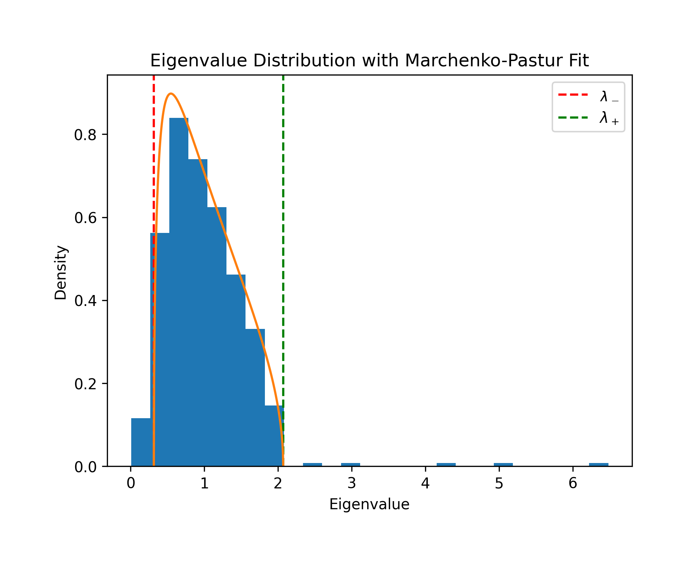
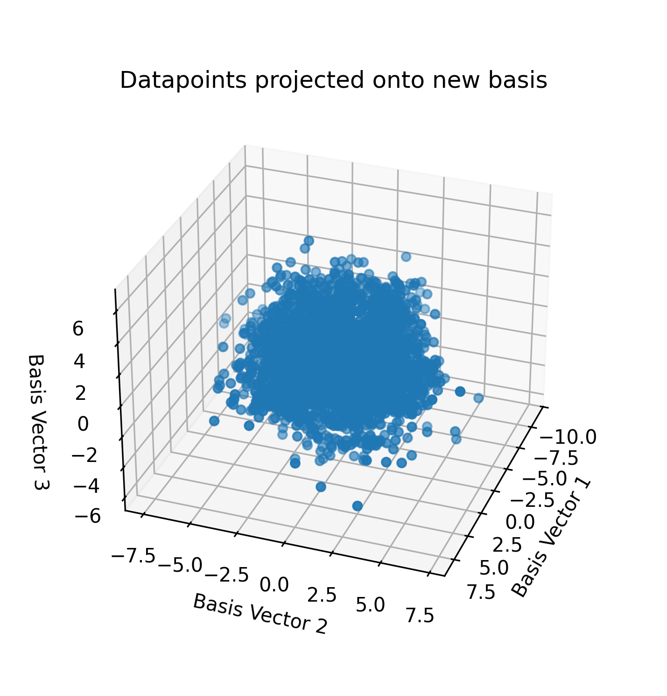
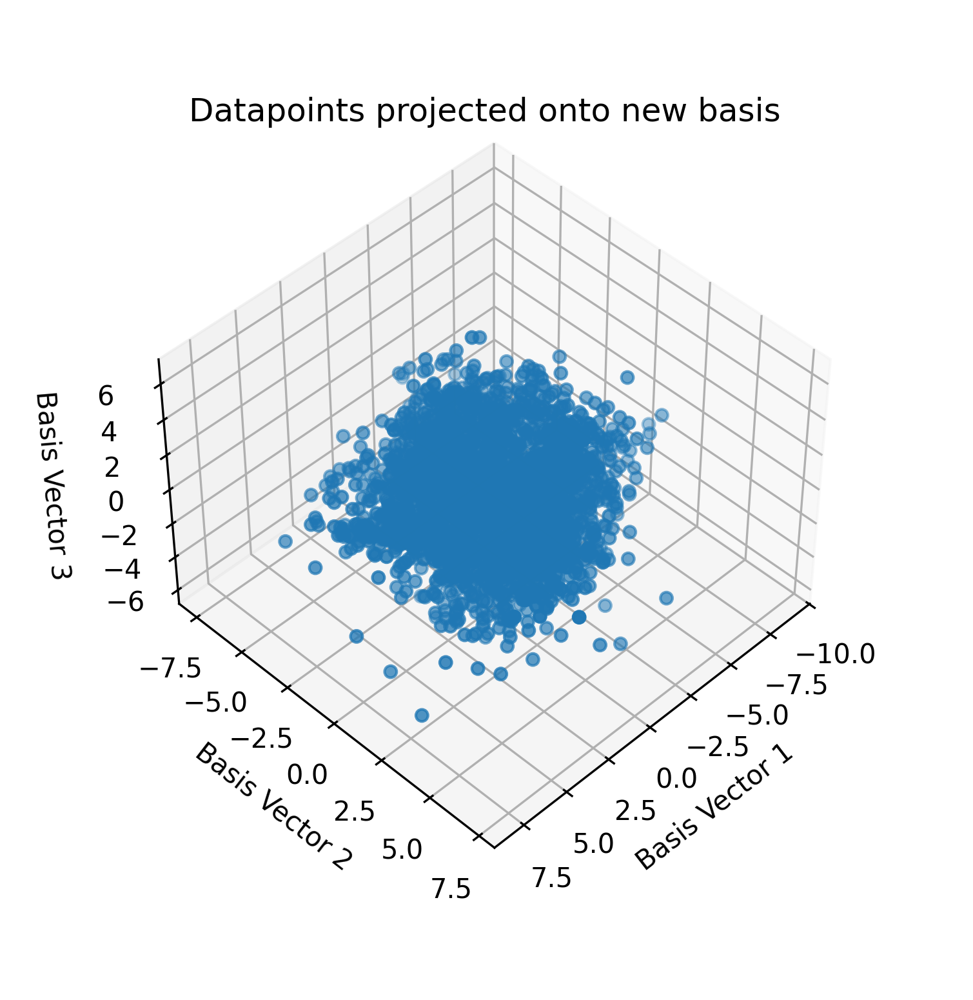

For my Math 182 class at UC San Diego, I analyzed the [Madelon](https://archive.ics.uci.edu/dataset/171/madelon) dataset from UC Irvine Machine Learning Repository.
This source was chosen due to its convenience and interest.
This README is a modified version of the final paper I wrote for that class, which has been cleaned up slightly.

# Dataset

I have elected to use the source (Madelon)[https://archive.ics.uci.edu/dataset/171/madelon] from UC Irvine Machine Learning Repository.
This source was chosen because I found it mildly interesting and because, after minimal cleanup, it met the requirements to be used in this project.
Cleanup consisted only of converting data to numeric form, eliminating non-numeric data, and deleting incomplete, empty, and missing rows.

After cleanup, the MADELON dataset had 2598 rows and 501 columns.
As a result, the gamma parameter was 0.192841 and therefore within the defined range.

After standardizing the data to zero mean and unit variance per feature, I computed the sample covariance matrix (which, for standardized data, is equivalent to the correlation matrix).
I then computed its eigenvalues and eigenvectors using `numpy.linalg.eig`.
The resulting 501 eigenvalues are the variances captured along each principal axis of the data.

# Marchenko-Pastur Method

To distinguish signal from noise, I fit the Marchenko-Pastur distribution to the eigenvalue spectrum.
With gamma of 0.192841 and sigma-square of 1 (since the data was standardized), the predicted noise bulk spans `[0.314568, 2.071113]`.
Of the 501 eigenvalues, 481 fell within this predicted bulk and 20 fell outside it.
The majority of eigenvalues align well with the Marchenko-Pastur prediction, suggesting that most of the variance in the data is consistent with uncorrelated noise.

The eigenvalues lying outside this range represent statistically significant signal components that cannot be explained by noise alone.
While the larger outliers suggest samples with higher variance that therefore may contain additional meaning, the smaller outliers imply near-linear relations, and therefore suggest that some parameters may be nearly useless, carrying little to no information in most cases.
20 eigenvalues exceeded the noise edge, suggesting that the data contains 20 statistically significant signal dimensions.

Using the eigenvectors corresponding to the 20 outlier eigenvalues as principal components, I projected the full 501-dimensional data onto the top 3 (of 20) signal dimensions for visualization. The resulting scatter plot represents the best 3-dimensional view of the data's underlying structure, with noise removed.

The significant eigenvalues are as follows:
* 6.483566
* 4.995935
* 4.268589
* 3.016056
* 2.451248
* 0.009966
* 0.009716
* 0.009582
* 0.009414
* 0.009304
* 0.008889
* 0.008690
* 0.008547
* 0.008379
* 0.008212
* 0.008041
* 0.007681
* 0.007518
* 0.007308
* 0.007174

# Analyses

Each eigenvector provides a linearly independent projection of the data which encodes some significant amount of information about the dataset.
That is, the variance explained by knowing the most significant projected value is at least as much as the amount explained by the most significant original parameter.
The outliers on the distribution are the most and least significant projections, respectively explaining the most and least variance.
Since there are 20 outliers, then there are 20 provided PCA projections with unusual quantities of information.

The estimates of the eigenvalue densities, as discerned using the Marchenko-Pastur distribution, are very accurate.
In particular, the estimates are roughly 95.85% accurate.
This indicates that the eigenvalues are distributed as expected, meaning that the normalized dataset largely follows an IID Gaussian standard normal distribution.

The projected data is the best possible representation of the data in three dimensions.
That is, there is no representation of this dataset with only three parameters that can be achieved via equivalent linear means.
This works by using orthogonal linear transformations as a set of unit vectors representing dimensions; those vectors with the most significant data (i.e., the eigenvectors with the highest corresponding eigenvalues) were used as the linear transformation.
This yields a three-dimensional linear recombination with the most information.

I elected to analyze the success of the projection using linear regression.
In particular, I regressed the second column of the dataset against both the first column and the most significant linear combination, so as to compare the success of a naive linear regression against a random parameter against the success of regressing against the most significant parameter.
One naive regression had an MSE of 0.999967, whereas the Marcenko-Pastur regression had an MSE of 0.997038.
In general, the Marcenko-Pastur performed better than about 99% of the naive regressions (496/500), implying that Marcenko-Pastur is generally better than regular naive strategies.
This analysis is clearly limited by only analyzing one of the top three best Marcenko-Pastur linear combinations; however, it shows that the use of Marcenko-Pastur analysis improved regression in this dataset, suggesting that the dataset contains real information and isn't pure noise.

# Conclusion

This class, and this project, have taught me that the Marchenko-Pastur method is incredibly useful in analyzing noisy data.
In particular, this method can both discover whether signal exists inside of noise, and help isolate the signal from the noise.
The use of this method may be applicable to Gaussian Brownian motion analyses of inefficient markets, thereby allowing a near-optimal linear predictor of future market state.

Future work may involve applying the Marcheko-Pastur distribution to inefficient markets to discern how effective this strategy is in exploiting a market whose behavior is only partially explained by Gaussian Brownian motion.
In addition, I may attempt to find places where this distribution fails, or where it can be improved on.

